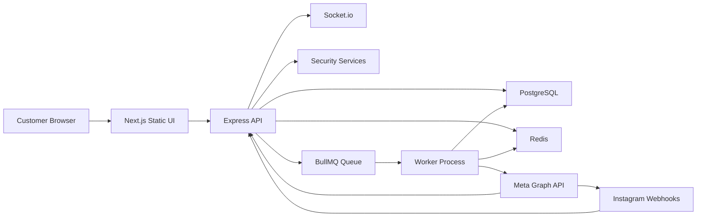
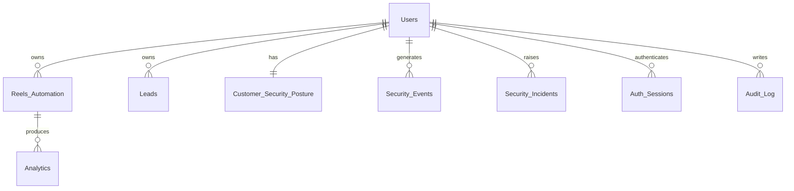

# GoLink Auto Current-State Blueprint

## Purpose
This document is the developer-facing blueprint for the current production-oriented state of the GoLink Auto codebase in `D:\GoLink IG\GoLink IG New`.

It is intended to help engineers understand:
- what is live and authoritative
- how the backend, worker, frontend, and database fit together
- how auth, security, and automation work today
- what was recently hardened
- what still needs engineering follow-through

This blueprint reflects the codebase after the structural cleanup, Prisma introduction, RBAC/CSRF hardening, and worker observability work.

## 1. Product Summary
GoLink Auto is an Instagram comment-to-DM automation platform with an embedded security layer.

Core product behavior:
- connect Instagram Business or Creator accounts through Meta OAuth
- import recent media/reels for rule setup
- create keyword-triggered reel automations
- receive Instagram webhook events for comments/messages
- queue public replies and private DMs
- store analytics and leads
- monitor suspicious traffic, sessions, incidents, and automation safety

## 2. Active Runtime Architecture

### 2.1 Single Sources of Truth
The only active entrypoints are:
- backend HTTP server: [server.js](/D:/GoLink%20IG/GoLink%20IG%20New/server.js)
- worker process: [worker.js](/D:/GoLink%20IG/GoLink%20IG%20New/worker.js)

Older duplicate entrypoint files under `src/` were removed. `src/` now only contains shared modules used by the root entrypoints.

### 2.2 Runtime Shape
The deployed system is split into:
- one web service that serves the API, webhook endpoints, Socket.io, and the statically exported Next frontend
- one worker service that processes BullMQ jobs and maintenance schedules

### 2.3 High-Level Component Diagram


## 3. Deployment Model

### 3.1 Hosting
The repo is designed for Render with Docker.

Relevant files:
- [Dockerfile](/D:/GoLink%20IG/GoLink%20IG%20New/Dockerfile)
- [package.json](/D:/GoLink%20IG/GoLink%20IG%20New/package.json)
- [client/package.json](/D:/GoLink%20IG/GoLink%20IG%20New/client/package.json)

### 3.2 Build and Start Behavior
Root scripts:
- `npm run build`: Prisma client generation plus client build/export
- `npm start`: `prisma migrate deploy` then starts [server.js](/D:/GoLink%20IG/GoLink%20IG%20New/server.js)
- `npm run worker`: `prisma migrate deploy` then starts [worker.js](/D:/GoLink%20IG/GoLink%20IG%20New/worker.js)
- `npm test`: Jest integration/security tests
- `npm run test:syntax`: syntax validation for server and worker

### 3.3 Frontend Serving
The frontend is built from `client/` and exported to `client/out`, then served by Express from the main web service.

## 4. Codebase Layout

### 4.1 Root-Level Active Files
- [server.js](/D:/GoLink%20IG/GoLink%20IG%20New/server.js): only backend entrypoint
- [worker.js](/D:/GoLink%20IG/GoLink%20IG%20New/worker.js): only worker entrypoint
- [db.js](/D:/GoLink%20IG/GoLink%20IG%20New/db.js): PostgreSQL pool
- [queue.js](/D:/GoLink%20IG/GoLink%20IG%20New/queue.js): Redis and BullMQ queue wiring
- [config.js](/D:/GoLink%20IG/GoLink%20IG%20New/config.js): app naming and automation timing
- [prisma/schema.prisma](/D:/GoLink%20IG/GoLink%20IG%20New/prisma/schema.prisma): current ORM schema
- [prisma/migrations/20260404000000_initial_baseline/migration.sql](/D:/GoLink%20IG/GoLink%20IG%20New/prisma/migrations/20260404000000_initial_baseline/migration.sql): baseline migration
- [schema.sql](/D:/GoLink%20IG/GoLink%20IG%20New/schema.sql): legacy reference only, no longer authoritative
- [.env.example](/D:/GoLink%20IG/GoLink%20IG%20New/.env.example): environment template

### 4.2 `src/` Responsibilities
`src/` now contains the reusable implementation modules, including:
- controllers
- middleware
- services
- generated Prisma client

Key active modules:
- [src/controllers/reelsController.js](/D:/GoLink%20IG/GoLink%20IG%20New/src/controllers/reelsController.js)
- [src/middleware/requestContext.js](/D:/GoLink%20IG/GoLink%20IG%20New/src/middleware/requestContext.js)
- [src/middleware/sessionAuth.js](/D:/GoLink%20IG/GoLink%20IG%20New/src/middleware/sessionAuth.js)
- [src/middleware/rateLimit.js](/D:/GoLink%20IG/GoLink%20IG%20New/src/middleware/rateLimit.js)
- [src/middleware/rbac.js](/D:/GoLink%20IG/GoLink%20IG%20New/src/middleware/rbac.js)
- [src/services/securityAgentService.js](/D:/GoLink%20IG/GoLink%20IG%20New/src/services/securityAgentService.js)
- [src/services/sessionService.js](/D:/GoLink%20IG/GoLink%20IG%20New/src/services/sessionService.js)
- [src/services/sessionStoreService.js](/D:/GoLink%20IG/GoLink%20IG%20New/src/services/sessionStoreService.js)
- [src/services/csrfService.js](/D:/GoLink%20IG/GoLink%20IG%20New/src/services/csrfService.js)
- [src/services/authFlowService.js](/D:/GoLink%20IG/GoLink%20IG%20New/src/services/authFlowService.js)
- [src/services/tokenRotationService.js](/D:/GoLink%20IG/GoLink%20IG%20New/src/services/tokenRotationService.js)
- [src/services/systemHealthService.js](/D:/GoLink%20IG/GoLink%20IG%20New/src/services/systemHealthService.js)
- [src/services/maintenanceScheduler.js](/D:/GoLink%20IG/GoLink%20IG%20New/src/services/maintenanceScheduler.js)
- [src/services/auditLogService.js](/D:/GoLink%20IG/GoLink%20IG%20New/src/services/auditLogService.js)

## 5. Environment Contract

### 5.1 Core Runtime
- `PORT`
- `NODE_ENV`
- `CLIENT_URL`
- `BACKEND_URL`
- `AUTH_PROVIDER`

### 5.2 Infrastructure
- `DATABASE_URL`
- `REDIS_URL`

### 5.3 Meta
- `FB_APP_ID`
- `FB_APP_SECRET`
- `FB_VERIFY_TOKEN`

### 5.4 Security
- `ENCRYPTION_KEY`
- `JWT_SECRET`
- `MASTER_PLATFORM_USER_ID`
- `ADMIN_PLATFORM_USER_IDS`

### 5.5 Optional
- `RAZORPAY_SECRET`
- `INSTAGRAM_ACCESS_TOKEN`

### 5.6 `AUTH_PROVIDER`
Supported values:
- `facebook`
- `instagram`

Current default is `facebook`.

Reason:
- Meta/Facebook dialog is the stable fallback with the present app configuration
- direct Instagram OAuth works only if the Meta app is configured for Instagram Login product correctly

## 6. Database Model

### 6.1 Source of Truth
The schema source of truth is now Prisma:
- [prisma/schema.prisma](/D:/GoLink%20IG/GoLink%20IG%20New/prisma/schema.prisma)
- Prisma migrations under `prisma/migrations`

`server.js` still contains lightweight compatibility fixes for legacy environments, but table definition ownership is intended to live in Prisma from this point forward.

### 6.2 Main Tables
- `Users`
- `Reels_Automation`
- `Analytics`
- `Leads`
- `Customer_Security_Posture`
- `Security_Events`
- `Security_Incidents`
- `Auth_Sessions`
- `Audit_Log`

### 6.3 Notable User Fields
`Users` now includes:
- `role`
- `token_expires_at`
- `last_login_at`
- `last_login_ip`
- `last_security_scan_at`

### 6.4 Entity Diagram


## 7. Authentication and Session Model

### 7.1 Auth Routes
- `GET /auth/url`
- `GET /auth/callback`
- `POST /auth/logout`
- `GET /api/me`

### 7.2 OAuth Flow
1. `GET /auth/url` issues a signed OAuth state token
2. user is redirected to either Instagram or Facebook OAuth depending on `AUTH_PROVIDER`
3. `GET /auth/callback` validates the signed state
4. backend exchanges code for short-lived token
5. backend upgrades to long-lived token
6. backend resolves the platform identity, preferring linked `instagram_business_account`
7. token is encrypted and stored
8. user role is determined from configured admin platform IDs
9. session is persisted in `Auth_Sessions`
10. JWT-backed session cookie is issued

### 7.3 Session Design
Sessions are hybrid:
- JWT carries the signed auth claims
- `Auth_Sessions` remains the revocation and activity source of truth

Benefits:
- revoke other sessions
- force logout
- deny access for locked users
- consistent audit trail for session actions

## 8. Security Architecture

### 8.1 Core Security Controls
- AES-256-GCM token encryption
- OAuth state signing and verification
- JWT-backed session cookies
- server-side session revocation
- CSRF protection on state-changing authenticated routes
- RBAC middleware on admin routes
- webhook signature verification
- token bucket rate limiting
- request security scoring and incident creation

### 8.2 RBAC Model
Current roles:
- `CUSTOMER`
- `ANALYST`
- `ADMIN`

Role checks are enforced through [src/middleware/rbac.js](/D:/GoLink%20IG/GoLink%20IG%20New/src/middleware/rbac.js).

Role assignment today is environment-driven:
- `MASTER_PLATFORM_USER_ID`
- `ADMIN_PLATFORM_USER_IDS`

This is materially better than the old single admin API key, but still not a full user-managed admin system.

### 8.3 CSRF Model
CSRF token issuance:
- `GET /api/csrf-token`

Protected state-changing routes include:
- `POST /auth/logout`
- `POST /api/reels/save`
- `POST /api/security/sessions/revoke-others`
- `POST /api/security/incidents/:incidentId/resolve`
- `POST /api/admin/users/:userId/security-lock`

### 8.4 Security Agent Layer
The security layer observes:
- request fingerprinting
- suspicious payloads
- auth anomalies
- rate-limit pressure
- webhook failures
- risky automation inputs

It stores:
- `Security_Events`
- `Customer_Security_Posture`
- `Security_Incidents`

## 9. Queue, Worker, and Maintenance

### 9.1 Queue Stack
- BullMQ
- Redis
- queue name: `messageQueue`

### 9.2 Worker Responsibilities
The worker handles:
- queued automation processing
- public reply scheduling
- private DM scheduling
- analytics writes
- lead insertion
- automation risk gating
- maintenance jobs

### 9.3 Heartbeat and Health
The worker writes a Redis heartbeat every 30 seconds.

Backend health route:
- `GET /api/admin/system-health`

If the worker heartbeat is stale, backend health logic flags an `automation-offline` incident in the database.

### 9.4 Maintenance Jobs
Scheduled through BullMQ repeat jobs:
- expired session pruning every 24 hours
- platform token rotation scan every 12 hours

## 10. Token Rotation

### 10.1 Purpose
The token rotation service monitors `Users.token_expires_at` and proactively attempts long-lived token refreshes before expiry.

### 10.2 Current Behavior
- scans for tokens expiring within the defined threshold window
- decrypts token
- requests refreshed token from Meta
- re-encrypts and stores updated token
- writes a `token-rotation-failed` incident if refresh fails

## 11. Backend API Surface

### 11.1 System
- `GET /`
- `GET /health`
- `GET /api/csrf-token`

### 11.2 Auth
- `GET /auth/url`
- `GET /auth/callback`
- `POST /auth/logout`
- `GET /api/me`

### 11.3 Automation
- `GET /api/reels/import`
- `POST /api/reels/save`

### 11.4 Customer Security
- `GET /api/security/overview`
- `GET /api/security/recommendations`
- `GET /api/security/sessions`
- `POST /api/security/sessions/revoke-others`
- `GET /api/security/audit-trail`
- `POST /api/security/incidents/:incidentId/resolve`

### 11.5 Admin
- `GET /api/admin/security/overview`
- `GET /api/admin/system-health`
- `POST /api/admin/users/:userId/security-lock`

### 11.6 Webhooks
- `GET /webhook/instagram`
- `POST /webhook/instagram`

## 12. Webhook and Automation Flow

### 12.1 Webhook Intake
`POST /webhook/instagram` does the following:
1. verifies `x-hub-signature-256`
2. parses Instagram change payloads
3. resolves the creator by `platform_user_id`
4. records webhook-related security history
5. locates an enabled automation rule
6. matches trigger keyword against comment text
7. enqueues BullMQ job for processing

### 12.2 Worker Execution
Worker then:
1. decrypts creator token
2. evaluates sentiment and automation risk
3. inserts or updates lead data
4. schedules public reply
5. sends private DM
6. writes analytics and security events
7. publishes live updates to the frontend

## 13. Frontend Application

### 13.1 Frontend Mode
The frontend is a statically exported Next.js app served by Express.

Routes:
- `/`
- `/login`
- `/security`
- `/reels`
- `/leads`
- `/settings`

### 13.2 Page Status
- `/`: functional dashboard shell with partial live data
- `/login`: auth entrypoint
- `/security`: most complete customer-facing screen
- `/reels`: placeholder/incomplete
- `/leads`: placeholder/incomplete
- `/settings`: placeholder/incomplete

### 13.3 Client Security Integration
Client auth flow uses:
- [client/src/contexts/AuthContext.js](/D:/GoLink%20IG/GoLink%20IG%20New/client/src/contexts/AuthContext.js)
- [client/src/lib/api.js](/D:/GoLink%20IG/GoLink%20IG%20New/client/src/lib/api.js)
- [client/src/lib/csrf.js](/D:/GoLink%20IG/GoLink%20IG%20New/client/src/lib/csrf.js)

The client now fetches CSRF tokens before protected writes.

## 14. Testing

### 14.1 Framework
Jest is configured through [jest.config.js](/D:/GoLink%20IG/GoLink%20IG%20New/jest.config.js).

### 14.2 Current Critical Tests
- [tests/webhook-verification.test.js](/D:/GoLink%20IG/GoLink%20IG%20New/tests/webhook-verification.test.js)
- [tests/auth-flow.test.js](/D:/GoLink%20IG/GoLink%20IG%20New/tests/auth-flow.test.js)
- [tests/rate-limiter.test.js](/D:/GoLink%20IG/GoLink%20IG%20New/tests/rate-limiter.test.js)

### 14.3 Current Coverage Reality
Coverage is still narrow. The most important missing areas are:
- worker end-to-end job execution
- token rotation integration
- session revocation APIs
- admin RBAC edge cases

## 15. Operational Notes

### 15.1 Web vs Worker
The web service can be healthy while the worker is down. The heartbeat-based system health route now reduces silent failure risk, but production still requires both runtimes to be deployed and monitored.

### 15.2 Render Reality
Current integrated deployment assumptions:
- Docker build runs Prisma generation and Next build successfully
- Express serves the exported frontend
- worker must be run separately with `npm run worker`

### 15.3 Prisma Adoption Note
Prisma is now part of the stack, but the baseline migration was created from the known schema shape in code rather than a live introspection against production. Before treating Prisma as canonical for future production migrations, the team should validate the generated schema against the actual live PostgreSQL instance.

## 16. Remaining Gaps
- Meta dashboard configuration still determines whether Instagram-branded login works
- several frontend pages remain scaffold-level
- role assignment is env-driven rather than admin-managed
- no full observability stack or external alerting yet
- no dedicated worker metrics dashboard yet
- migration history should be validated against the real production database

## 17. Recommended Next Workstreams

### 17.1 Platform Maturity
- validate Prisma schema against live DB and create any corrective migrations
- add worker deployment monitoring and alerting
- expose queue depth metrics and failed-job visibility

### 17.2 Security Completion
- add admin-managed roles instead of env-only promotion
- add token expiry warnings to customer UI
- add session and incident retention policies

### 17.3 Product Completion
- build real reels management
- build real leads workspace
- build usable settings and token status surface
- connect dashboard cards to live backend metrics

## 18. Quick Start

### 18.1 Prerequisites
- PostgreSQL
- Redis
- Meta app credentials
- Node.js 20+

### 18.2 Commands
```bash
npm install
npm run build
npm start
npm run worker
npm test
```

### 18.3 Validation
- backend health: `GET /health`
- system health: `GET /api/admin/system-health`
- current user: `GET /api/me`
- webhook verification: `GET /webhook/instagram`
- frontend routes: `/`, `/login`, `/security`

## 19. Final Summary
GoLink Auto is now a cleaner, more disciplined system than the earlier MVP stage.

Its current strengths are:
- single backend and worker entrypoints
- Prisma-backed schema foundation
- JWT sessions plus server-side revocation
- RBAC and CSRF protection on key admin/write flows
- worker heartbeat and system-health monitoring
- baseline security-focused integration tests

Its main remaining risks are:
- Meta auth configuration dependency
- incomplete customer-facing product surfaces
- still-limited automated coverage
- production schema validation still needed before long-term Prisma-led migration work
