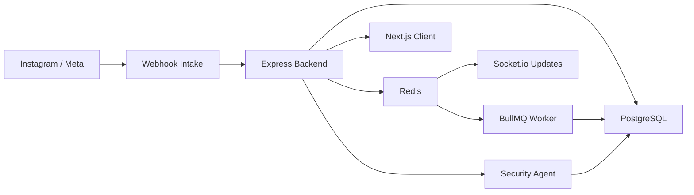

# Project Blueprint: GoLink Auto (GoLink IG)

## 1. Project Overview
GoLink Auto is a secure Instagram comment-to-DM automation platform built for creators, brands, and growth teams. Its job is to convert social engagement into leads while protecting connected customer accounts from abuse, unsafe automation patterns, suspicious sessions, and takeover attempts.

### Core Value Proposition
- Turn qualifying comments into DMs automatically.
- Generate and track leads from Instagram engagement.
- Use AI-assisted sentiment and risk analysis before automation acts.
- Give customers and operators visibility into account security posture.

## 2. System Architecture

### Backend
- Runtime: Node.js with Express
- Active entrypoint: [server.js](/D:/GoLink%20IG/GoLink%20IG%20New/server.js)
- Pattern: backend monolith with modular services and middleware
- Responsibility:
  - OAuth and session handling
  - Webhook verification and intake
  - Security monitoring and audit trails
  - Customer and admin APIs
  - Database bootstrapping and migrations

### Worker and Queue
- Queue: BullMQ
- Broker: Redis
- Worker entrypoint: [worker.js](/D:/GoLink%20IG/GoLink%20IG%20New/worker.js)
- Responsibility:
  - delayed public replies
  - delayed private DMs
  - lead creation
  - sentiment analysis updates
  - automation threat recording

### Frontend
- Stack: Next.js app in `client/`
- Responsibility:
  - customer dashboard
  - login flow
  - future security center and admin-facing views

### Real-Time
- Transport: Socket.io
- Source: Redis pub/sub channel `lead-health-update`
- Responsibility:
  - push live sentiment and activity updates to the dashboard

### High-Level Diagram

## 3. Data Model

### Core Tables
- `Users`
  - customer identity
  - encrypted access token
  - security timestamps
  - active/locked status
- `Reels_Automation`
  - one automation rule for a reel and trigger keyword
  - optional public reply text
  - outbound affiliate link
- `Analytics`
  - automation action history
  - sentiment scoring
- `Leads`
  - captured lead identity and status
- `Subscriptions`
  - present in legacy schema blueprint, available for billing expansion

### Security Tables
- `Customer_Security_Posture`
  - customer-level risk state
  - suspicious and blocked counts
- `Security_Events`
  - request and automation threat events
- `Security_Incidents`
  - higher-severity incidents requiring review
- `Auth_Sessions`
  - persistent backend session control
  - revocation support
- `Audit_Log`
  - immutable action history for customer/admin operations

### Relationship Diagram

## 4. Core Logic Flows

### Meta OAuth Flow
1. Client requests `/auth/url`.
2. Backend creates signed OAuth state token.
3. User authorizes through Meta.
4. Meta returns to `/auth/callback`.
5. Backend validates `state`, exchanges code for token, upgrades to long-lived token, encrypts it, stores customer record, creates session, and sets `auth_token`.

### Webhook Flow
1. Instagram sends a comment webhook.
2. Backend verifies `x-hub-signature-256`.
3. Backend finds matching active user and reel automation.
4. Matching events are queued into BullMQ.
5. Worker processes sentiment, risk, public reply, DM, and analytics.

### Automation Loop
1. Comment arrives.
2. Trigger keyword is matched.
3. Comment sentiment is scored.
4. Undercover security agent evaluates threat indicators.
5. If safe, queue schedules public reply and DM with smart delay.
6. Lead and analytics records are updated.

### Customer Security Flow
1. Customer signs in.
2. Backend monitors requests, fingerprints, and session usage.
3. Customer can review sessions, incidents, and audit logs.
4. Customer can revoke other sessions.
5. Customer can resolve incidents after review.

### Admin Security Flow
1. Admin authenticates with `x-admin-api-key`.
2. Admin loads security overview.
3. Admin reviews incidents and risky users.
4. Admin can security-lock a customer account and revoke sessions.
5. All actions are written to audit log.

## 5. Service Layer

### `platformService`
- Meta Graph API orchestration
- `appsecret_proof` generation
- DM sending
- public comment reply
- long-lived token refresh

### `sentimentService`
- sentiment scoring for comments
- label mapping: positive, neutral, negative

### `urlService`
- dynamic GoLink generation
- hash-based short link pattern

### `sessionService`
- signed session and OAuth state token creation

### `sessionStoreService`
- persistent DB-backed session lifecycle
- revoke and revoke-all-other-sessions support

### `securityAgentService`
- request risk scoring
- suspicious fingerprint tracking
- customer posture updates
- incident creation
- automation threat checks

### `auditLogService`
- records sensitive actions for later investigation

## 6. Security and Compliance

### Token Security
- access tokens stored encrypted with AES-256-GCM
- session cookies are signed and short-lived
- OAuth callback uses signed state validation

### Session Security
- backend validates DB-backed active session state
- revoked sessions cannot continue using signed cookies
- customer can revoke all other sessions

### Traffic Protection
- webhook signature validation
- rate limiting on auth, security, and admin routes
- suspicious payload analysis
- event-based threat logging

### Account Protection
- customer security posture tracking
- incident creation for higher-risk activity
- admin lock/unlock flow

### Legal Views
- privacy policy
- terms of service
- data deletion flow

## 7. Deployment Notes

### Runtime
- containerized deployment through Docker
- production hosting target: Render

### Required Services
- PostgreSQL
- Redis
- Meta app credentials

### Important Environment Variables
- `DATABASE_URL`
- `REDIS_URL`
- `FB_APP_ID`
- `FB_APP_SECRET`
- `FB_VERIFY_TOKEN`
- `ENCRYPTION_KEY`
- `JWT_SECRET`
- `CLIENT_URL`
- `BACKEND_URL`
- `ADMIN_API_KEY`

## 8. Current Gaps and Next Phase
- build a real customer Security Center UI
- add token expiry monitoring and warnings
- add safe mode to pause automation during high-risk periods
- add subscriptions and billing completion if monetization is required
- add role-based agency and team access
- replace placeholder client metrics with live backend analytics

## 9. Naming Alignment
- Product name: `GoLink Auto`
- Alternate/internal legacy label: `GoLink IG`
- Avoid using unrelated placeholder names such as `Cloud Clarity`
- Treat `Extreme Media World` and `EMW` as company/operator identity, not product name
